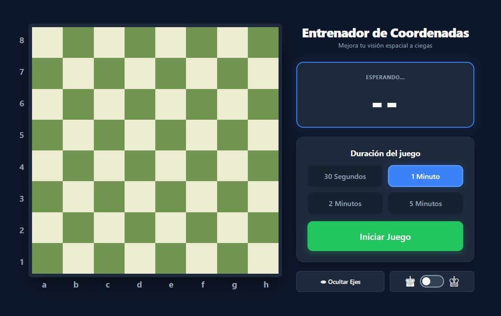
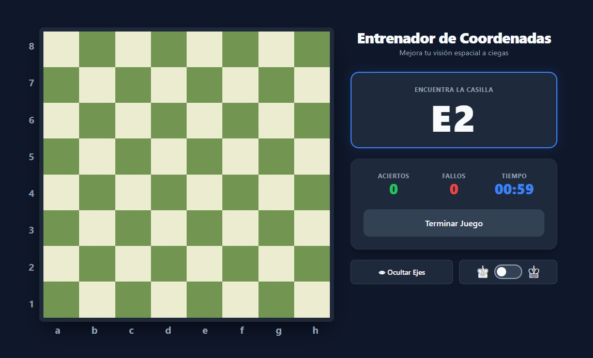

# ♟️ Entrenador de Coordenadas de Ajedrez

**[👉 Juega la versión en vivo aquí](https://estebanpechuan.github.io/entrenamiento-casillas-ajedrez/)**

Una aplicación web interactiva y ligera diseñada para ayudar a los jugadores de ajedrez a mejorar su visión espacial y memorización del tablero. Encuentra las casillas correctas a contrarreloj y domina la lectura de coordenadas a ciegas.

## 📸 Vistas Previas

## ✨ Características

- **Modos de Tiempo:** Elige entre sesiones de práctica rápidas o intensas (30 segundos, 1 minuto, 2 minutos o 5 minutos).

- **Cambio de Perspectiva:** Juega desde el lado de las piezas Blancas o Negras. Un switch interactivo invierte el tablero al instante.

- **Dificultad Adaptable:** Oculta o muestra los ejes de coordenadas (letras y números) en tiempo real para poner a prueba tu memoria absoluta.

- **Estadísticas Detalladas:** Lleva el registro de tus aciertos, fallos y calcula tu porcentaje de precisión final al terminar el tiempo.

- **Diseño Responsivo (Mobile-Friendly):** Interfaz moderna con tema oscuro, construida con CSS Grid para adaptarse perfectamente tanto a monitores grandes como a pantallas de teléfonos móviles.

- **Feedback Visual:** Respuestas inmediatas con destellos de color (verde/rojo) sin interrumpir el flujo del juego.

## 🛠️ Tecnologías Utilizadas

Este proyecto es 100% "Vanilla". No requiere instalación de paquetes, compiladores ni dependencias externas:

- **HTML5:** Estructura semántica en un único archivo.

- **CSS3 (Puro):** Layouts complejos usando CSS Grid y Flexbox, variables nativas y animaciones sin frameworks.

- **Vanilla JavaScript:** Lógica de estado del juego, temporizadores y manipulación del DOM nativa.

## 🚀 Cómo usar o desplegar

Al estar contenido todo en un solo archivo (`index.html`), tienes varias opciones súper sencillas:

### Opción 1: Uso local

1. Clona este repositorio o descarga el código fuente.

2. Haz doble clic en el archivo `index.html` para abrirlo directamente en tu navegador web favorito (Chrome, Firefox, Safari, Edge, etc.). ¡No necesitas un servidor local!

### Opción 2: Despliegue en la web (Gratis)

Puedes tener un enlace público en menos de 1 minuto usando servicios gratuitos:

- **Vercel o Netlify:** Conecta tu repositorio de GitHub directamente a estas plataformas. Cada vez que hagas un _push_, tu sitio se actualizará automáticamente.

- **Netlify Drop:** Simplemente arrastra y suelta la carpeta contenedora o el archivo `index.html` en [app.netlify.com/drop](https://app.netlify.com/drop).

## 🧠 ¿Por qué entrenar las coordenadas?

Dominar la notación algebraica (ej. `e4`, `c5`, `Nf3`) es fundamental para:

1. Leer libros y artículos de ajedrez con fluidez, sin necesidad de armar un tablero físico.

2. Calcular variantes profundas en tu mente (ajedrez a ciegas).
   <<<<<<< HEAD

3. # Seguir retransmisiones de torneos y entender rápidamente de qué casilla están hablando los comentaristas.
4. Seguir retransmisiones de torneos y entender rápidamente de qué casilla están hablando los comentaristas.
   > > > > > > > cc202c8b9c154d43ffa64210d88514f6a8d7f462
